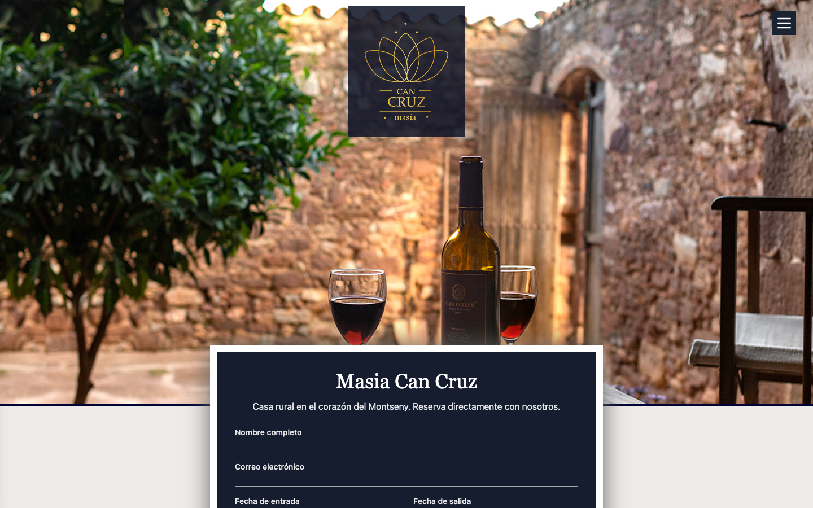
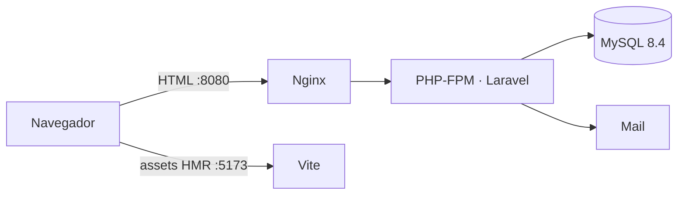
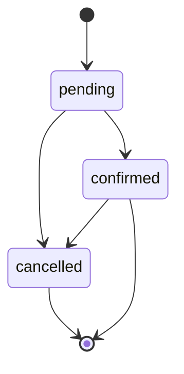
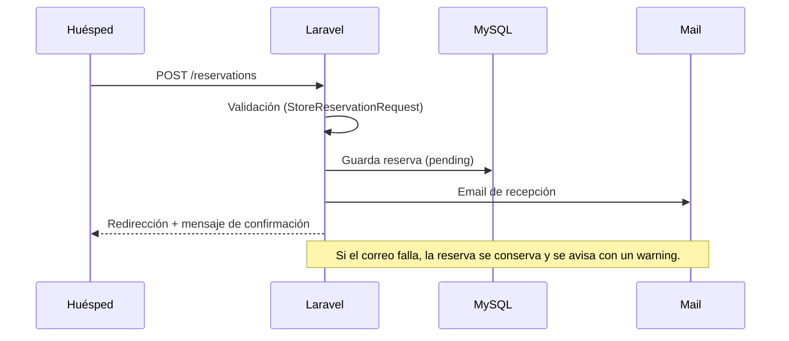

# Masia Can Cruz — Web de reservas

[](https://github.com/Sergi-Virgili/CanCruzWeb/actions/workflows/ci.yml)

Aplicación Laravel 13 para gestionar las reservas de **Masia Can Cruz**, una casa rural en el Parc Natural del Montseny. Da a los huéspedes un canal de reserva directo (sin intermediarios) y al administrador un panel sencillo para revisar, confirmar, editar o cancelar cada solicitud.



## Funcionalidades

- **Formulario público en la home** — nombre, correo, fechas de entrada/salida y mensaje. Se valida en servidor y devuelve los errores en español.
- **Alta de reservas** — cada solicitud se guarda como `pending` y dispara un email de recepción al huésped.
- **Panel de administración** — listado de reservas con estado y acciones; edición de datos de la reserva.
- **Workflow de estados** — transiciones controladas y auditables (ver [Arquitectura](#arquitectura)).
- **Emails de workflow** — recepción, confirmación y cancelación (plantillas Blade/Mailable).
- **Protección anti-spam** — límite de envíos por IP configurable.
- **Sin registro público** — el administrador se aprovisiona con el comando `admin:create`.

## Stack

| Capa | Tecnología |
|------|------------|
| Framework | Laravel 13 |
| Lenguaje | PHP 8.4 |
| Vistas | Blade + Tailwind CSS 4 |
| Frontend build | Vite 8 |
| Base de datos | MySQL 8.4 (SQLite en memoria para tests) |
| Servidor web | Nginx + PHP-FPM |
| Contenedores | Docker Compose (desarrollo y producción) |
| Tests | PHPUnit 12 (unit/feature) + Playwright (e2e) |
| Formato | Laravel Pint |

## Inicio rápido

Requisitos: Docker y Docker Compose. Para la suite e2e, además Node 22 (`npm`).

```bash
# 1. Variables de entorno
cp .env.example .env

# 2. Levantar el stack (app, nginx, db, vite)
docker compose up -d --build

# 3. Generar la clave de aplicación
docker compose exec app php artisan key:generate

# 4. Migrar la base de datos
docker compose exec app php artisan migrate --force

# 5. Crear el administrador (pedirá contraseña)
docker compose exec app php artisan admin:create admin@example.com

# 6. Comprobar que todo responde
curl --fail http://localhost:8080/up
```

Abre **http://localhost:8080** y entra en **http://localhost:8080/login** con el administrador creado.

### URLs de desarrollo

| Servicio | URL | Notas |
|----------|-----|-------|
| Aplicación | http://localhost:8080 | La web (nginx → PHP-FPM) |
| Vite | http://localhost:5173 | Servidor de assets/HMR. **No es la web**: abrir `/` muestra una página informativa |
| Health check | http://localhost:8080/up | Devuelve HTTP 200 |

En desarrollo, nginx y Vite se publican **solo en `127.0.0.1`**: no son accesibles desde otros equipos de la red local. Vite es una herramienta de desarrollo y nunca forma parte de la imagen de producción.

## Arquitectura



La app es un monolito server-rendered. La lógica de reservas vive en una capa de dominio pequeña:

- `app/Enums/ReservationStatus.php` — estados y reglas de transición.
- `app/Actions/TransitionReservation.php` — transición atómica con bloqueo (`lockForUpdate`).
- `app/Http/Controllers/**` — controladores finos (público, admin, auth).
- `app/Http/Requests/**` — validación y autorización.
- `app/Mail/**` + `resources/views/mail/**` — emails del workflow.
- `app/Console/Commands/**` — `admin:create`, `reservations:prune-qa`.

### Estados de una reserva



Se permiten `pending → confirmed`, `pending → cancelled` y `confirmed → cancelled`. Una reserva cancelada no se reabre, y repetir la transición actual se rechaza (evita emails duplicados). La cancelación **no borra** la fila.

### Flujo de una reserva



### Modelo de datos

Tabla `reservations`: `name`, `email`, `entry_date`, `out_date`, `message`, `status`, `confirmed_at`, `cancelled_at` y timestamps.

## Configuración (`.env`)

| Variable | Descripción | Ejemplo |
|----------|-------------|---------|
| `APP_KEY` | Clave de cifrado (`php artisan key:generate`) | `base64:...` |
| `APP_ENV` / `APP_DEBUG` | Entorno y depuración | `local` / `true` |
| `APP_URL` | URL pública de la app | `http://localhost:8080` |
| `APP_PORT` | Puerto de nginx en desarrollo | `8080` |
| `VITE_PORT` | Puerto de Vite (HMR) | `5173` |

**Base de datos**

| Variable | Descripción | Ejemplo |
|----------|-------------|---------|
| `DB_CONNECTION` | Driver | `mysql` |
| `DB_HOST` | Host (`db` dentro de Docker) | `db` |
| `DB_PORT` | Puerto | `3306` |
| `DB_DATABASE` | Nombre de la base de datos | `laravel` |
| `DB_USERNAME` / `DB_PASSWORD` | Credenciales | `laravel` / `secret` |
| `DB_ROOT_PASSWORD` | Contraseña root (producción) | — |

**Correo**

| Variable | Descripción | Ejemplo |
|----------|-------------|---------|
| `MAIL_MAILER` | Driver (`log` guarda los correos en el log en desarrollo) | `smtp` / `log` |
| `MAIL_HOST` / `MAIL_PORT` | Servidor SMTP | `smtp.example.com` / `587` |
| `MAIL_USERNAME` / `MAIL_PASSWORD` | Credenciales SMTP | — |
| `MAIL_FROM_ADDRESS` / `MAIL_FROM_NAME` | Remitente | `hello@example.com` |

**Administrador y límites**

| Variable | Descripción | Ejemplo |
|----------|-------------|---------|
| `ADMIN_NAME` | Nombre del administrador | `"Can Cruz Admin"` |
| `ADMIN_BOOTSTRAP_PASSWORD` | Contraseña para `admin:create` (si está vacío, pide prompt o falla en no interactivo) | — |
| `RESERVATION_THROTTLE_PER_MINUTE` | Máximo de envíos por minuto e IP (producción `5`; desarrollo `60`) | `5` |

**End-to-end (opcional, solo para la suite Playwright)**

| Variable | Descripción | Por defecto |
|----------|-------------|-------------|
| `E2E_BASE_URL` | URL objetivo | `http://localhost:8080` |
| `E2E_ADMIN_EMAIL` / `E2E_ADMIN_PASSWORD` | Credenciales del admin | `admin@cancruz.test` / `password` |
| `E2E_SLOW_MO` | Milisegundos de cámara lenta (modo visible) | `0` |
| `E2E_SKIP_CLEANUP` | `1` para no limpiar datos de prueba | — |

## Comandos útiles

```bash
# Migraciones
docker compose exec app php artisan migrate

# Consola de administrador
docker compose exec app php artisan admin:create admin@example.com

# Borrar reservas creadas por la suite e2e (prefijo "QA E2E")
docker compose exec app php artisan reservations:prune-qa

# Formatear código (Pint)
docker compose exec app vendor/bin/pint

# Limpiar cachés
docker compose exec app php artisan optimize:clear

# Logs
docker compose logs -f app
docker compose logs -f vite
```

En desarrollo, los correos con `MAIL_MAILER=log` se escriben en `storage/logs/laravel.log`.

## Testing

La suite PHPUnit usa SQLite en memoria y no necesita el contenedor de base de datos.

```bash
# Suite completa
docker compose exec app php artisan test

# Un fichero concreto
docker compose exec app php artisan test tests/Feature/PublicReservationTest.php

# Con cobertura (la imagen de desarrollo incluye Xdebug)
docker compose exec app php artisan test --coverage
```

### End-to-end (Playwright)

Los e2e manejan la aplicación real en un navegador y requieren el stack levantado.

```bash
# Una vez: crear el administrador con las credenciales de la suite
npm run e2e:admin

npm run e2e          # headless
npm run e2e:watch    # visible, con cámara lenta
npm run e2e:ui       # modo UI interactivo
npm run e2e:report   # abrir el informe HTML
```

- 10 tests: flujo público (home, alta, validación) y administración (login, confirmar, cancelar, editar, logout).
- Configuración en `playwright.config.js`; credenciales y URL por variables `E2E_*`.
- Cada ejecución crea reservas `QA E2E …` y un *teardown* global las borra con `reservations:prune-qa`.

## Integración continua

GitHub Actions se ejecuta en cada push a `master` y en cada pull request (`.github/workflows/ci.yml`):

| Job | Qué hace |
|-----|----------|
| `php` | PHP 8.4 + SQLite, `vendor/bin/pint --test` y `php artisan test` |
| `e2e` | Compila assets, levanta el stack, migra, crea el admin, ejecuta Playwright y sube el informe como artifact |

## Despliegue en producción

```bash
# Construir y arrancar (imagen inmutable, sin bind mounts)
docker compose -f compose.prod.yaml --env-file .env.production up -d --build

# Migrar (explícito, no automático al arrancar)
docker compose -f compose.prod.yaml exec app php artisan migrate --force

# Crear el administrador
docker compose -f compose.prod.yaml exec app php artisan admin:create admin@example.com

# Health check
curl --fail https://your-domain.com/up
```

La imagen de producción (`runtime` en `docker/php/Dockerfile`) no incluye dependencias de desarrollo ni el servidor de Vite. Crea un `.env.production` con `APP_ENV=production`, `APP_DEBUG=false`, `APP_KEY`, credenciales de base de datos y SMTP reales.

### Copias de seguridad

```bash
#!/bin/bash
# Backup diario (añadir a cron)
docker compose -f compose.prod.yaml exec -T db mysqldump \
  -u root -p"${DB_ROOT_PASSWORD}" "${DB_DATABASE}" \
  | gzip > "/backups/cancruz-$(date +%F-%H%M).sql.gz"

# Conservar 30 días
find /backups -name "cancruz-*.sql.gz" -mtime +30 -delete
```

## Solución de problemas

| Síntoma | Causa / solución |
|---------|------------------|
| **502 Bad Gateway** en 8080 | El contenedor `app` (PHP-FPM) está caído: `docker compose ps` y `docker compose logs app`. |
| `Vite manifest not found` | Vite no está corriendo y no hay assets compilados. Levanta `vite` o ejecuta `npm run build`. |
| `http://localhost:5173/` muestra una página "Laravel Vite" | Esperado: 5173 es el servidor de assets, no la web. La app está en 8080. |
| `key:generate` → *Permission denied* | En Linux, `.env` pertenece a tu usuario: `docker compose exec -u root app php artisan key:generate`. |
| La app no puede escribir logs/vistas (Linux) | `chmod -R 777 storage bootstrap/cache`. |
| `Connection refused` al migrar | MySQL aún arrancando: reintenta en unos segundos. El health check usa TCP. |
| Puertos ocupados | Cambia `APP_PORT` / `VITE_PORT` en `.env`. |

## Convenciones

- **Formato:** Laravel Pint (`vendor/bin/pint`).
- **Commits:** estilo convencional (`feat:`, `fix:`, `test:`, `docs:`, `ci:`).
- **Tests primero:** los flujos se cubren con PHPUnit (dominio/HTTP) y Playwright (e2e).
- Las convenciones para agentes están en [`AGENTS.md`](AGENTS.md).

## Documentación

- **Especificación de diseño:** [`docs/superpowers/specs/2026-09-16-laravel-13-modernization-design.md`](docs/superpowers/specs/2026-09-16-laravel-13-modernization-design.md)
- **Plan de implementación:** [`docs/superpowers/plans/2026-09-16-laravel-13-modernization.md`](docs/superpowers/plans/2026-09-16-laravel-13-modernization.md)
- **CI:** [`.github/workflows/ci.yml`](.github/workflows/ci.yml)

## Licencia

Software propietario de CanCruzWeb.
